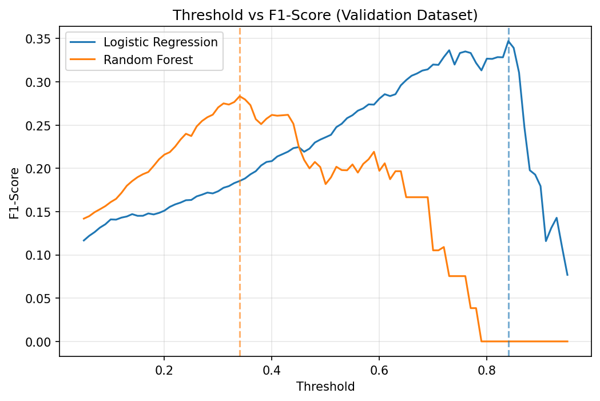
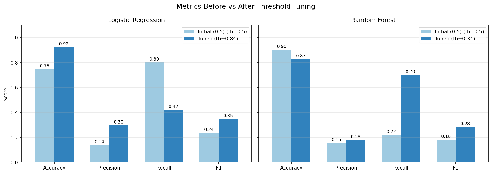
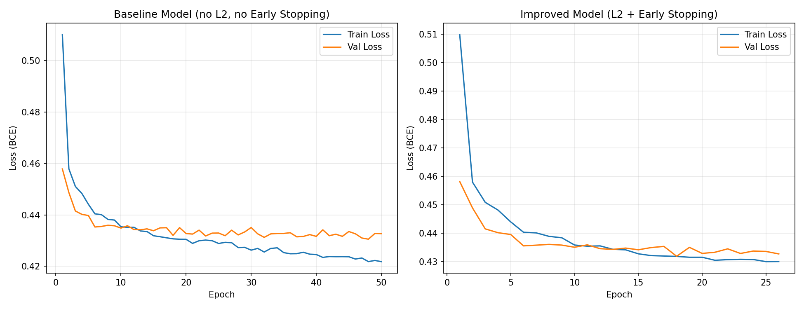
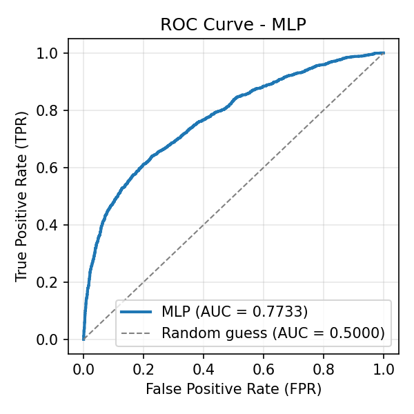

# Week 1：機器學習與深度學習分類任務

本週作業包含三個 Quiz，皆整合於 [`main.ipynb`](./main.ipynb)（可直接於 Google Colab 執行）。

| Quiz | 主題 | 資料集 | 模型 |
|---|---|---|---|
| Quiz1 | 機器學習分類任務（Threshold 微調） | [Stroke Prediction Dataset](https://www.kaggle.com/datasets/fedesoriano/stroke-prediction-dataset) | Logistic Regression、Random Forest |
| Quiz2 | 信用卡違約預測（過擬合改善） | [UCI Credit Card Default](https://www.kaggle.com/datasets/uciml/default-of-credit-card-clients-dataset) | MLP（Baseline vs. Improved） |
| Quiz3 | 模型表現評估（ROC / AUC） | 同 Quiz2 | MLP vs. Decision Tree |

## 目錄

- [環境需求](#環境需求)
- [專案結構](#專案結構)
- [Quiz1 機器學習分類任務](#quiz1-機器學習分類任務)
- [Quiz2 深度學習信用卡違約預測](#quiz2-深度學習信用卡違約預測)
- [Quiz3 模型表現評估](#quiz3-模型表現評估)

## 環境需求

- Python 3.11
- numpy、pandas、matplotlib、scikit-learn
- torch
- kagglehub、joblib

```bash
pip install -r requirements.txt
```

資料集透過 `kagglehub` 自動下載，無須手動準備。

## 專案結構

```
week1/
├── main.ipynb          # 三個 Quiz 的完整程式與說明
├── README.md
├── Data/               # 數據集數據集
└── Outputs/            # README 使用的結果圖
```

## Quiz1 機器學習分類任務

**目標**：預測病患是否中風（`stroke`），並比較兩個模型在 Threshold 微調前後的表現。

### 資料概況

- 資料維度：5110 筆 × 12 欄
- `stroke = 1` 僅 249 筆（約 4.87%），屬於**嚴重類別不平衡**，因此不能只看 Accuracy，需搭配 Precision、Recall、F1。
- `bmi` 有 201 筆缺失值，以中位數補值。

### 前處理

| 欄位類型 | 欄位 | 處理方式 |
|---|---|---|
| 數值 | `age`、`avg_glucose_level`、`bmi` | `SimpleImputer(median)` → `StandardScaler` |
| 類別 | `gender`、`hypertension`、`heart_disease`、`ever_married`、`work_type`、`Residence_type`、`smoking_status` | `OneHotEncoder` |

- 移除無預測意義的 `id`。
- 以 80:20 切分 Training / Validation（4088 / 1022 筆），使用 `stratify=y` 維持類別比例。
- 前處理包進 `Pipeline`，只用 Training Dataset fit，避免 data leakage。

### 模型

- **Logistic Regression**：`class_weight="balanced"`、`max_iter=1000`
- **Random Forest**：`n_estimators=300`、`min_samples_leaf=5`、`class_weight="balanced_subsample"`

### Threshold 微調

在 0.05 ~ 0.95 之間每隔 0.01 試一個 Threshold，挑選 **F1-Score 最高**者。



### 結果（Validation Dataset，共 1022 筆，其中中風 50 筆）

| 模型 | Threshold | Accuracy | Precision | Recall | F1 | TN | FP | FN | TP |
| :--- | :---: | :---: | :---: | :---: | :---: | :---: | :---: | :---: | :---: |
| Logistic Regression（初始） | 0.50 | 0.7466 | 0.1384 | 0.8000 | 0.2360 | 723 | 249 | 10 | 40 |
| Logistic Regression（微調） | 0.84 | 0.9227 | 0.2958 | 0.4200 | 0.3471 | 922 | 50 | 29 | 21 |
| Random Forest（初始） | 0.50 | 0.9031 | 0.1549 | 0.2200 | 0.1818 | 912 | 60 | 39 | 11 |
| Random Forest（微調） | 0.34 | 0.8268 | 0.1777 | 0.7000 | 0.2834 | 810 | 162 | 15 | 35 |

ROC-AUC：Logistic Regression **0.8437**、Random Forest **0.8133**。




### 結論

- **Logistic Regression**：Precision 較高（0.30 對 0.18），預測中風時較可信，但 Recall 僅 0.42，50 位中風者只抓到 21 位。
- **Random Forest**：Recall 較高（0.70 對 0.42），抓到 35 位中風者，但 Precision 只有 0.18，預測為中風的人約 5 個只有 1 個真的中風。
- 以 F1 來看，Logistic Regression（0.35）略勝 Random Forest（0.28），但兩者都不高，主要原因是中風樣本僅佔約 5%。
- 兩個模型微調後都是 **False Positive 較多**（LR：FP 50 / FN 29；RF：FP 162 / FN 15），呈現不同的 Precision–Recall trade-off：LR 偏向減少 FP，RF 在較低 Threshold 下提高 Recall、減少 FN，但代價是更多 FP。

## Quiz2 深度學習信用卡違約預測

**目標**：以 MLP 預測客戶下個月是否違約（`default.payment.next.month`），並比較 Baseline 與加入改善策略後的 Improved 模型。

### 資料處理

- 移除 `ID` 欄位，80:20 切分 Training / Validation，使用 `stratify=y`。
- `StandardScaler` 只以 Training Set fit，再套用到 Validation Set，避免資料洩漏。

### 模型架構

`Input → Linear(64) → ReLU → Dropout → Linear(32) → ReLU → Dropout → Linear(16) → ReLU → Dropout → Linear(1)`

### 超參數

| 超參數 | 設定值 | 說明 |
|---|---:|---|
| `TEST_SIZE` | 0.2 | Validation Set 佔 20% |
| `BATCH_SIZE` | 64 | 每次更新使用 64 筆資料 |
| `LEARNING_RATE` | 0.001 | 學習率（Adam） |
| `HIDDEN_LAYERS` | [64, 32, 16] | 3 層 Hidden Layer |
| `DROPOUT_RATE` | 0.2 | Dropout 比例 |
| `BASELINE_EPOCHS` | 50 | Baseline 固定訓練 50 個 epochs |
| `MAX_EPOCHS` | 100 | Improved 最多訓練 100 個 epochs |
| `PATIENCE` | 8 | Val Loss 連續 8 個 epochs 未改善即停止 |
| `L2_WEIGHT_DECAY` | 0.0001 | L2 Regularization 強度 |

Loss Function 為 `BCEWithLogitsLoss`。

### 實驗設計

- **Baseline**：固定訓練 50 epochs，無 L2、無 Early Stopping。
- **Improved**：加入 L2 Regularization（`weight_decay=1e-4`）與 Early Stopping（`patience=8`），停止後恢復 Validation Loss 最低時的權重。
- 兩者使用相同的資料處理、MLP 架構與初始權重，確保比較公平。

### 結果

| 指標 | Baseline | Improved |
|---|---:|---:|
| Final Train Loss | 0.4231 | 0.4301 |
| Final Val Loss | 0.4358 | 0.4324 |
| Best Val Loss | 0.4318 | 0.4320 |
| Accuracy | 0.8198 | 0.8192 |
| Precision | 0.6694 | 0.6658 |
| Recall | 0.3662 | 0.3662 |
| F1-Score | 0.4735 | 0.4725 |
| AUC | 0.7697 | 0.7727 |
| Epochs Run | 50 | 25 |



### 結論

- **Overfitting 明顯改善**：Train/Val Loss 差距由 0.0127 縮小至 0.0022。
- **分類效能大致持平**：Validation Loss 幾乎不變，Accuracy / Precision / F1 僅小幅下降（0.001 ~ 0.004），Recall 持平。
- **訓練更穩定、更有效率**：Early Stopping 在第 25 個 epoch 觸發，以一半的 epoch 數達到相近的驗證表現。
- Recall 偏低是類別不平衡的徵兆，後續可嘗試調整網路架構、更換 Optimizer 或處理類別不平衡。

## Quiz3 模型表現評估

**目標**：載入 Quiz2 的 Improved MLP，並與 Decision Tree 比較 ROC Curve 與 AUC。

- 使用與 Quiz2 相同的資料切分（same seed、same ratio）與 Scaler。
- **MLP**：載入 Quiz2 儲存的 `quiz2_improved.pt`。
- **Decision Tree**：`max_depth=6`、`min_samples_leaf=20`。

### MLP 的 ROC Curve



- **ROC Curve**：呈現不同 Threshold 下 TPR 與 FPR 的關係，曲線越靠近左上方，模型越好。
- **AUC**：ROC 曲線下方面積，越接近 1 越好，0.5 代表隨機猜測。MLP 的 AUC = 0.7727，代表隨機抽一位會違約與一位不會違約的客戶，模型給前者較高風險分數的機率為 77.27%。

### MLP vs. Decision Tree

| 模型 | Validation AUC |
|---|---:|
| MLP | **0.7727** |
| Decision Tree | 0.7479 |


### 結論

MLP 的 ROC 曲線多數區段位於 Decision Tree 上方，AUC 也較高（0.7727 > 0.7479），代表在相同的誤報率（FPR）下，MLP 通常能捕捉到更多真正違約的客戶（TPR），整體區分能力優於 Decision Tree。