# Week 3：CNN 影像分類（Oxford-IIIT Pet）

本週作業包含三個 Quiz，皆整合於 [`main.ipynb`](main.ipynb)（可直接於 Google Colab 執行），程式碼模組化放在 `Codes/` 中。

| Quiz  | 主題                                   | 資料集                                                                 | 模型 / 方法                                        |
| ----- | -------------------------------------- | ---------------------------------------------------------------------- | -------------------------------------------------- |
| Quiz1 | 問題定義、資料切分、K-Fold             | [Oxford-IIIT Pet（官方）](https://www.robots.ox.ac.uk/~vgg/data/pets/) | 官方 trainval / test 切分 + Stratified 5-Fold      |
| Quiz2 | Plain CNN vs. Transfer Learning、ROC、超參數實驗 | 同 Quiz1                                                     | 自製 Plain CNN、ResNet-18（ImageNet 預訓練）       |
| Quiz3 | 資料擴增、Kernel 視覺化、XAI           | 同 Quiz1                                                               | 擴增前後比較、Grad-CAM、Occlusion Sensitivity、Trimap 前景量化 |

## 目錄

- [環境需求](#環境需求)
- [專案結構](#專案結構)
- [Quiz1 資料集與切分](#quiz1-資料集與切分)
- [Quiz2 訓練 CNN 影像分類模型](#quiz2-訓練-cnn-影像分類模型)
- [Quiz3 提升泛化能力與模型解釋](#quiz3-提升泛化能力與模型解釋)
- [整體結論與限制](#整體結論與限制)

## 環境需求

- Python 3.13（Google Colab，GPU：CUDA）
- numpy、pandas、matplotlib、scikit-learn、pillow
- torch、torchvision

```
pip install -r requirements.txt
```

資料集由 `torchvision.datasets.OxfordIIITPet` 從 Oxford VGG 官方網站自動下載並解壓到 `Data/oxford-iiit-pet/`（`images.tar.gz` 約 792 MB、`annotations.tar.gz` 約 19 MB），無須手動準備。ResNet-18 / MobileNetV2 / ResNet-50 的 ImageNet 預訓練權重同樣由 torchvision 自動下載。

## 專案結構

```
week3/
├── main.ipynb          # 三個 Quiz 的完整程式、輸出與說明
├── README.md
├── requirements.txt
├── Codes/
│   ├── Quiz1.py        # 官方資料下載、切分、K-Fold、Dataset / DataLoader、Trimap 工具、存圖與存模型
│   ├── Quiz2.py        # Plain CNN、Backbone、訓練、評估、ROC、K-Fold CV、超參數實驗
│   └── Quiz3.py        # 資料擴增、Kernel 視覺化、Grad-CAM / Occlusion、Trimap 量化
├── Data/
│   └── oxford-iiit-pet/
│       ├── images/         # 影像（.jpg）
│       └── annotations/    # trainval.txt、test.txt、trimaps/、xmls/
└── Outputs/
    ├── figures/        # Q{1,2,3}_*.png（本 README 使用的結果圖）
    ├── models/         # q{2,3}_*.pt（模型權重）
    └── *.csv           # 測試集預測結果、比較表、K-Fold / 超參數 / XAI 結果
```

圖片以 `Q1_`、`Q2_`、`Q3_` 開頭命名，模型權重以 `q2_`、`q3_` 開頭命名。

---

## Quiz1 資料集與切分

說明資料來源與內容，建立訓練 / 驗證 / 測試資料，並定義影像分類問題。

### 資料來源與內容

- 資料集：[Oxford-IIIT Pet Dataset](https://www.robots.ox.ac.uk/~vgg/data/pets/)（**官方版本**，含 `images/` 與 `annotations/`）。
- 共 **37 個貓狗品種**（**12 種貓、25 種狗**），官方標註共 7,349 張，每個品種約 200 張，影像大小、姿勢、背景與光線皆不一。
- 貓 / 狗與品種標籤皆由檔名推得（例如 `Abyssinian_1.jpg`、`american_bulldog_100.jpg`）。
- 官方版附有 **Trimap**（像素級標註：1 = 寵物、2 = 背景、3 = 邊界 / 未分類），Quiz3 的 XAI 用它來量化 Grad-CAM 是否落在寵物身上；DataFrame 因此多一欄 `trimap_path`，不影響 Quiz2 的訓練流程。

[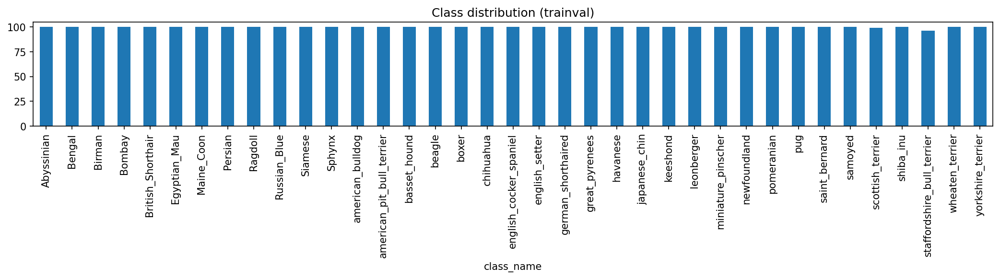](Outputs/figures/Q1_class_distribution.png)

[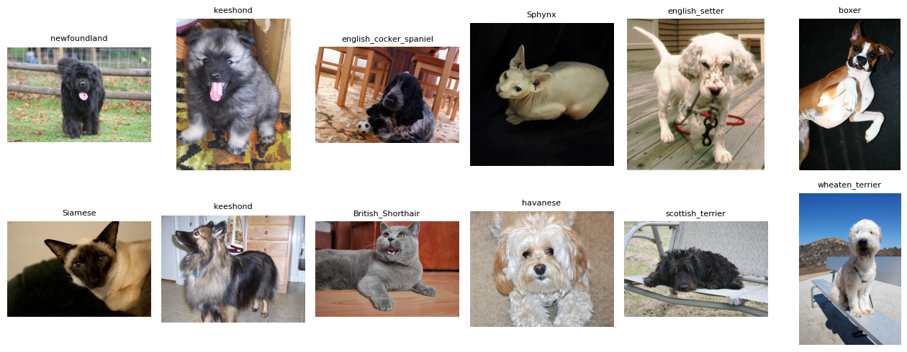](Outputs/figures/Q1_samples.png)

[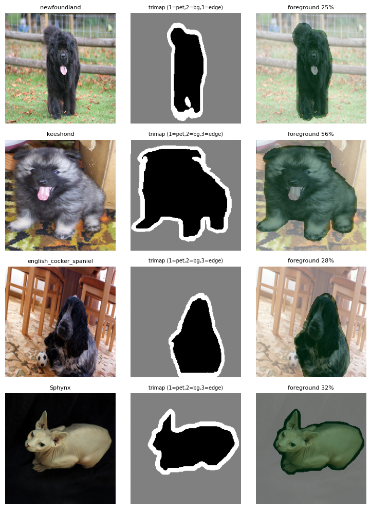](Outputs/figures/Q1_trimap_samples.png)

上圖每列依序為原圖、trimap、前景遮罩疊圖，用來確認影像與 trimap 對得上。

### 問題定義

| 項目   | 內容                                                                                                                                                  |
| ---- | --------------------------------------------------------------------------------------------------------------------------------------------------- |
| 任務   | 影像分類（單標籤、多類別，37 類）                                                                                                                                  |
| 輸入   | 一張 RGB 寵物影像                                                                                                                                         |
| 輸出   | 37 個品種的機率分布；最高者為 Top-1 預測，並另外評估 Top-5                                                                                                               |
| 困難點  | **細粒度分類 (Fine-Grained Classification, FGC)** ：品種間外觀非常相似（例如 Staffordshire Bull Terrier 與 American Pit Bull Terrier、British Shorthair 與 Russian Blue） |
| 評估指標 | Top-1 / Top-5 Accuracy、各類別 ROC 與 Macro-AUC、參數量、訓練時間                                                                                                 |

### 資料類別

資料集共有 37 個品種，可依動物種類分為：

|動物種類|品種數量|分類目標|
|---|---|---|
|Cat|12|辨識 12 種貓的具體品種|
|Dog|25|辨識 25 種狗的具體品種|
|**Total**|**37**|**37-class breed classification**|

Cat / Dog 並不是本實驗的最終分類類別，模型是在 37 個品種中進行分類。

### 分類問題

本資料集主要屬於 Fine-Grained Image Classification (FGC)問題。不同類別之間可能具有高度相似的外觀特徵，如: 

- Staffordshire Bull Terrier / American Pit Bull Terrier
- British Shorthair / Russian Blue

這些品種可能具有相似的毛色、臉部輪廓、身體比例或姿勢，使模型需要學習較細微的視覺特徵。

另一方面，同一品種內部也可能存在較大的變異，例如不同的拍攝角度、姿勢、背景、光線及個體差異。因此模型同時需要處理：

- **Inter-class similarity**：不同品種之間外觀相似
- **Intra-class variation**：同一品種內部影像差異大

這也是本實驗比較 Plain CNN 與經典 CNN Backbone 分類效能的重要原因之一。


### 資料切分

直接使用**官方切分檔** `annotations/trainval.txt` 與 `annotations/test.txt`，因此結果與官方 benchmark 的切分方式一致：

| 切分 | 張數 | 狗 | 貓 |
| -- | -- | -- | -- |
| Trainval | 3,680 | 2,492（約 67.7%） | 1,188（約 32.3%） |
| Test | 3,669 | 2,486 | 1,183 |

- 兩邊的貓狗比例幾乎相同，整體偏向狗，但 37 個品種各自接近均衡（trainval 每類約 93～100 張），沒有嚴重的類別不平衡，Top-1 Accuracy 可直接作為主要指標。
- 兩邊皆涵蓋全部 37 個品種。
- Test 僅用於最終評估，不參與訓練、挑模型或調參，避免資料洩漏。

接著，再將 Trainval 以 **Stratified 5-Fold Cross Validation** 進行切分，使每一折維持接近原始的品種比例：

| 折 | Train | Val |
| -- | ----- | --- |
| Fold 0 ~ 4 | 2,944 | 736 |

> 主要實驗（Quiz2 主模型、Quiz3）固定使用 **Fold 0** 的 train / val；完整 5-Fold 交叉驗證見 [Quiz2-4](#quiz2-4-完整-5-fold-交叉驗證)。


### 前處理

所有影像首先轉換為 RGB 格式，再依照模型輸入尺寸進行 Resize，並使用 ImageNet 的 mean 與 standard deviation 進行正規化。

不同模型採用不同的輸入解析度：

|模型|Input Size|
|---|---|
|Plain CNN|128 × 128|
|CNN Backbone|224 × 224|

如此可在控制計算量的同時，分別比較自行設計的 Plain CNN 與經典 CNN Backbone 在 37 類細粒度影像分類任務上的表現。


### 評估指標

本實驗主要使用以下指標評估模型：

1. **Top-1 Accuracy**  
    模型最高機率的預測類別是否與真實品種相同。
2. **Top-5 Accuracy**  
    真實品種是否出現在模型預測機率最高的前五個類別中。
3. **ROC Curve / Macro-AUC**  
    將 37 個類別分別視為 one-vs-rest binary classification，計算各類別 ROC Curve，並以 Macro-AUC 衡量模型在所有類別上的整體分類能力。
4. **Parameter Count**  
    比較不同模型的參數量，以評估模型複雜度。
5. **Training Time**  
    記錄模型訓練所需時間，作為計算成本的比較依據。
6. **Trimap 前景注意力指標**（Quiz3）  
    以官方 Trimap 量化 Grad-CAM 熱圖落在寵物前景的程度（fg_energy、gain、hit，定義見 [Quiz3-3](#quiz3-3-xaigrad-cam-與-occlusion-sensitivity)）。


---

## Quiz2 訓練 CNN 影像分類模型

### Quiz2-1 Plain CNN（自行設計，無資料擴增）

**架構**：VGG 風格，共 4 個 stage，通道數 32 → 64 → 128 → 256；每個 stage 為 2 × (Conv3×3 → BatchNorm → ReLU) + MaxPool；最後 GAP → Dropout(0.3) → FC(37)。**參數量 1,182,725（1.18M）**。

| 超參數        | 設定                          |
| ------------- | ----------------------------- |
| 輸入大小      | 128 × 128                     |
| Optimizer     | AdamW（lr = 2e-3，weight decay 1e-4） |
| 學習率排程    | OneCycle                      |
| Batch size    | 64                            |
| Epochs        | 30（以 val Top-1 最佳 epoch 還原權重） |
| 資料擴增      | 無                            |

[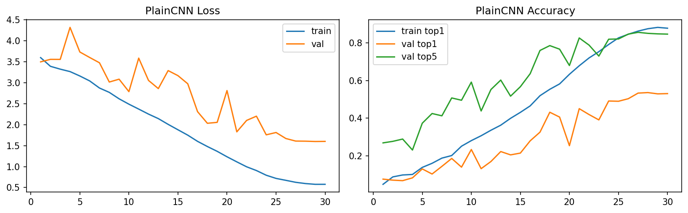](Outputs/figures/Q2_plain_history.png)

**結果（Test Dataset，3,669 張）**：**Top-1 = 48.46%、Top-5 = 83.10%**（Fold 0 驗證 Top-1 = 54.8%，最佳 epoch 即最後的第 30 epoch）。

- 明顯過擬合：最後一個 epoch 的訓練準確率為 91.9%（以評估模式重算整個訓練集為 96.2%），驗證僅 54.8%。
- 前 20 個 epoch 驗證曲線震盪很大（例如第 7 epoch 14.4% → 第 8 epoch 7.9%，val loss 一度衝到 5.88；第 17 → 18 epoch 由 28.8% 掉到 23.6%），後期隨 OneCycle 學習率下降才趨穩並快速上升（第 21 epoch 34.8% → 第 26 epoch 51.4%）。
- 預測結果存於 `Outputs/q2_pred_plain.csv`（欄位：`file`、`true`、`pred_top1`、`confidence`、`pred_top5`、`correct_top1`、`correct_top5`）。
- 最難分辨的品種（Top-1）：

| 品種                       | Top-1 | Top-5 |
| -------------------------- | ----- | ----- |
| chihuahua                  | 0.060 | 0.520 |
| american_pit_bull_terrier  | 0.130 | 0.590 |
| staffordshire_bull_terrier | 0.258 | 0.528 |
| english_cocker_spaniel     | 0.300 | 0.850 |
| beagle                     | 0.310 | 0.940 |
| wheaten_terrier            | 0.320 | 0.700 |

- 混淆最多的組合：British_Shorthair ↔ Russian_Blue（各 28 張，灰色短毛貓）、great_pyrenees → samoyed（28 張，白色大型犬）、Birman → Ragdoll（24 張）、Siamese → Birman（19 張）；chihuahua 被誤判成 shiba_inu 與 Sphynx（各 19 張）。
- 前 10 筆測試預測中，Abyssinian 有 4 筆被判成狗（boxer、chihuahua 等），顯示模型對毛色與整體輪廓的依賴很重，連貓 / 狗大類都會搞錯（僅為少數樣本的觀察）。

隨機抽樣的預測（綠 = 答對、紅 = 答錯）與高信心錯誤：

| 隨機抽樣 | 高信心錯誤 |
| --- | --- |
| [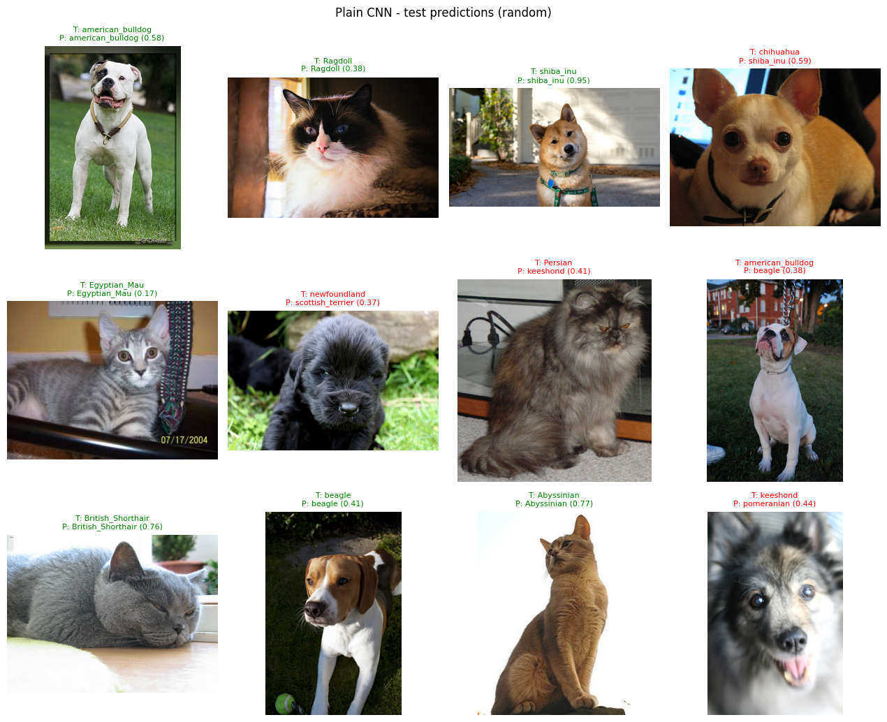](Outputs/figures/Q2_plain_predictions_random.png) | [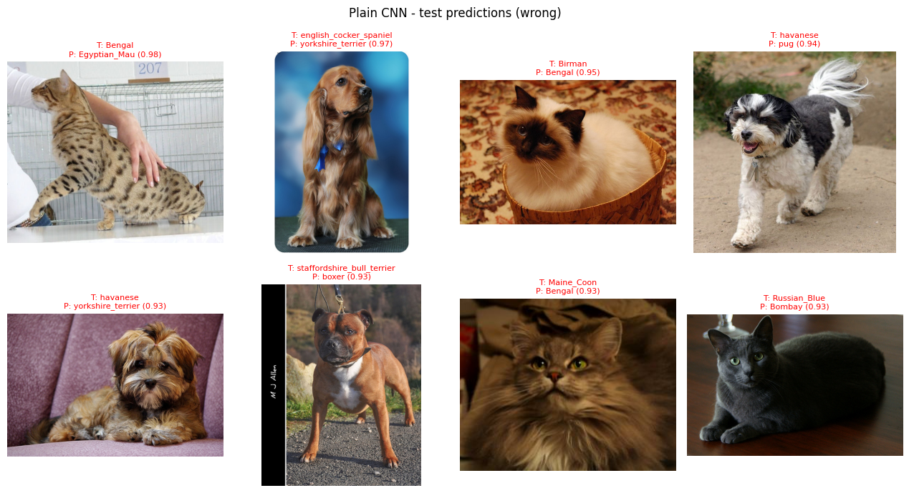](Outputs/figures/Q2_plain_predictions_wrong.png) |

[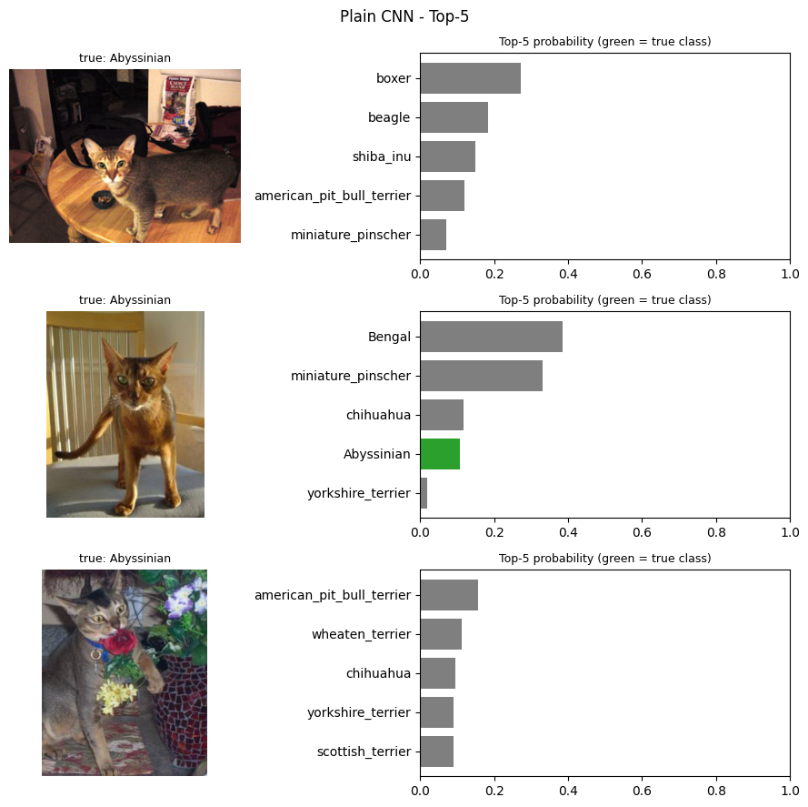](Outputs/figures/Q2_plain_top5.png)

### Quiz2-2 經典 CNN Backbone：ResNet-18（Transfer Learning，無資料擴增）

**做法**：載入 ImageNet 預訓練的 ResNet-18，把 `fc` 換成 Dropout + Linear(37)，**全網路微調**。**參數量 11,195,493（11.2M）**。

| 超參數        | 設定                          |
| ------------- | ----------------------------- |
| 輸入大小      | 224 × 224                     |
| Optimizer     | AdamW（lr = 1e-3，weight decay 1e-4） |
| 學習率排程    | OneCycle                      |
| Batch size    | 64                            |
| Epochs        | 10（以 val Top-1 最佳 epoch 還原權重） |
| 資料擴增      | 無                            |

[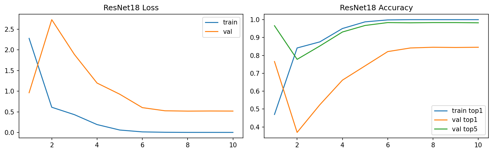](Outputs/figures/Q2_resnet18_history.png)

**結果（Test Dataset）**：**Top-1 = 83.51%、Top-5 = 97.90%**，比 Plain CNN 高 35.1 個百分點。

- 預訓練讓第 1 個 epoch 的驗證 Top-1 就達 78.1%。第 2 ~ 4 epoch 驗證暫時下降（39.0%、66.0%、72.6%，第 2 epoch val loss 升至 2.33），推測是 OneCycle 暖身期學習率持續升高（上限 1e-3），對預訓練權重偏大，之後隨學習率下降而恢復（第 6 epoch 回到 86.1%）。
- 第 7 ~ 10 epoch 驗證 Top-1 持平在 87.4% ~ 87.5%（還原最佳 epoch 後為 87.5%）；第 7 epoch 起訓練準確率已達 100%，仍有過擬合（訓練 100% vs. 驗證 87.5% vs. 測試 83.5%）。
- 驗證與測試約差 3 ~ 4 個百分點，Plain CNN 也有類似現象（54.8% → 48.5%），見 [Quiz2-4](#quiz2-4-完整-5-fold-交叉驗證)。
- 預測結果存於 `Outputs/q2_pred_resnet18.csv`。
- 混淆最多的組合集中在外觀相近的品種：staffordshire_bull_terrier → american_pit_bull_terrier（18 張）、Ragdoll → Birman（15 張）、american_pit_bull_terrier → american_bulldog（13 張）、basset_hound → beagle（13 張）、Birman → Ragdoll（13 張）。

| 隨機抽樣 | 高信心錯誤 |
| --- | --- |
| [](Outputs/figures/Q2_resnet18_predictions_random.png) | [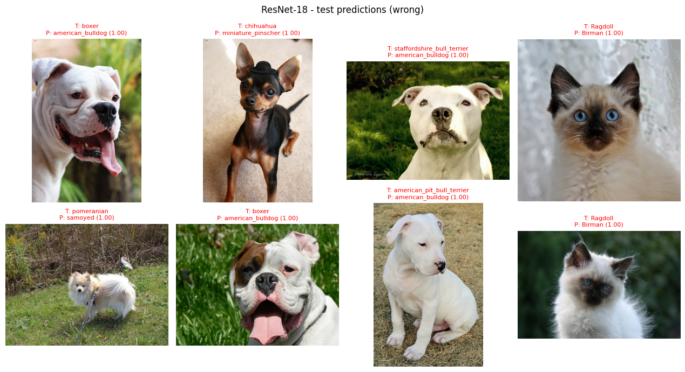](Outputs/figures/Q2_resnet18_predictions_wrong.png) |

[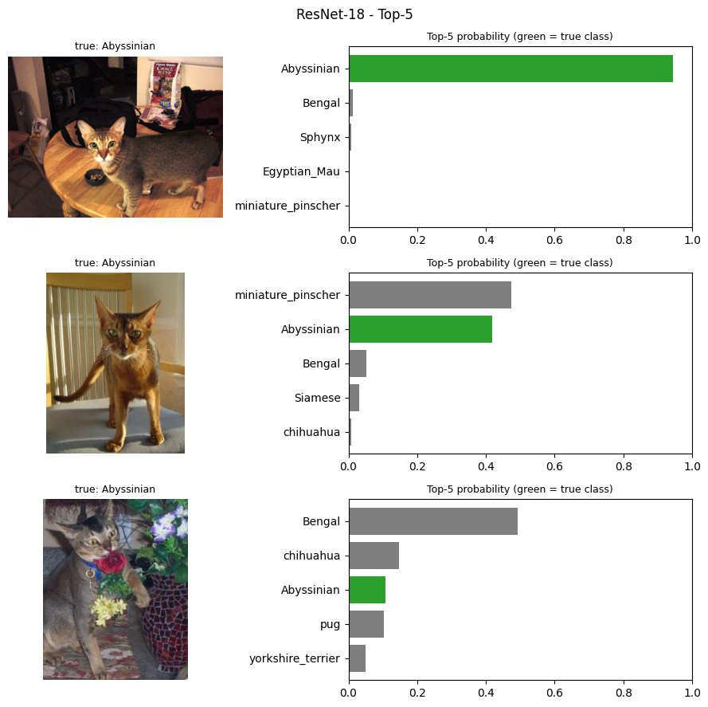](Outputs/figures/Q2_resnet18_top5.png)

**測試集預測範例**（前 8 筆，真實類別皆為 Abyssinian，因測試集依檔名排序）：

| 檔名             | Plain CNN 預測（信心）                 | ResNet-18 預測（信心）          |
| ---------------- | -------------------------------------- | ------------------------------- |
| Abyssinian_201   | boxer (0.27) ✗                         | Abyssinian (0.94) ✓             |
| Abyssinian_202   | Abyssinian (0.29) ✓                    | Abyssinian (0.98) ✓             |
| Abyssinian_204   | Bengal (0.39) ✗                        | miniature_pinscher (0.47) ✗     |
| Abyssinian_205   | american_pit_bull_terrier (0.16) ✗     | Bengal (0.49) ✗                 |
| Abyssinian_206   | Abyssinian (0.36) ✓                    | Maine_Coon (0.59) ✗             |
| Abyssinian_207   | chihuahua (0.30) ✗                     | Abyssinian (0.43) ✓             |
| Abyssinian_20    | miniature_pinscher (0.20) ✗            | miniature_pinscher (0.46) ✗     |
| Abyssinian_210   | Bengal (0.45) ✗                        | Abyssinian (0.92) ✓             |

[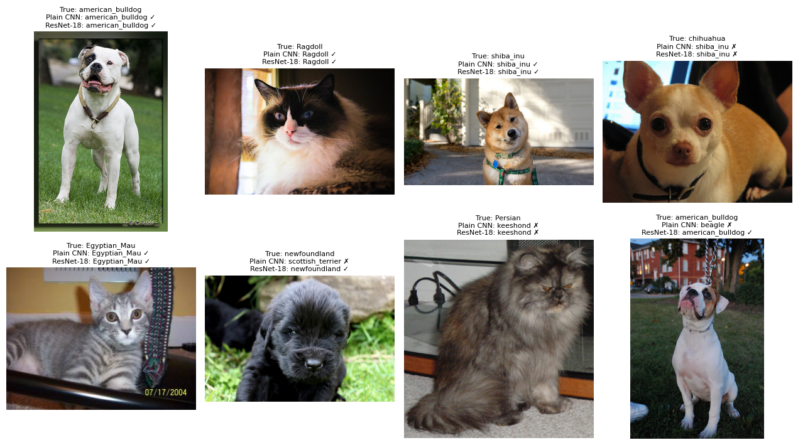](Outputs/figures/Q2_prediction_comparison.png)

### Quiz2-3 ROC Curve、Macro-AUC 與參數量比較

**做法**：對 37 個類別各畫一條 One-vs-Rest ROC 曲線；**Macro-AUC = 各類別 AUC 的平均**；另畫 macro-average 曲線。

| Plain CNN | ResNet-18 |
| --------- | --------- |
| [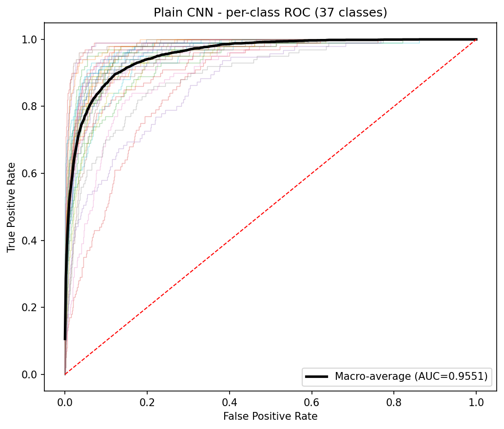](Outputs/figures/Q2_plain_roc.png) | [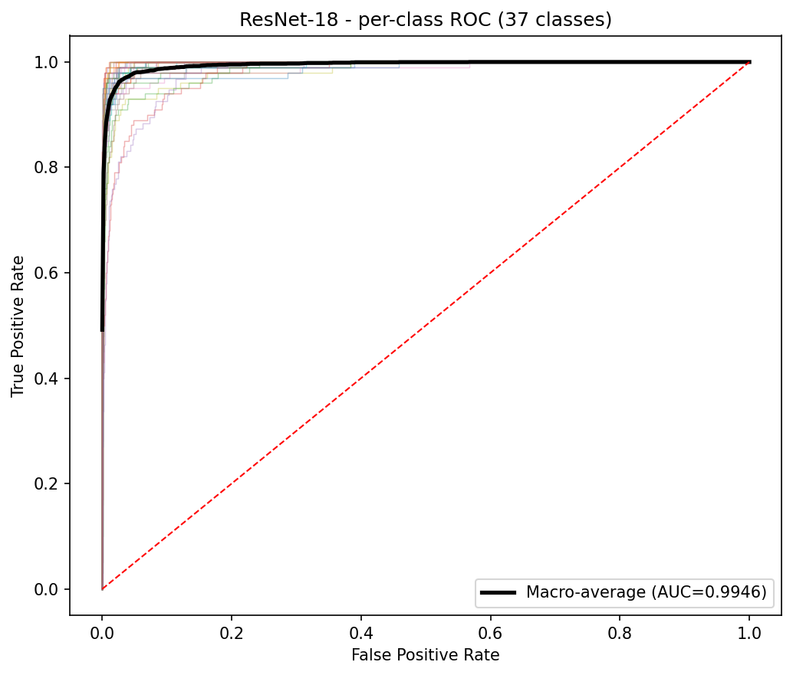](Outputs/figures/Q2_resnet18_roc.png) |

AUC 最低的類別：

| 模型      | AUC 最低的 5 個類別（AUC）                                                                                          |
| --------- | ------------------------------------------------------------------------------------------------------------------- |
| Plain CNN | american_pit_bull_terrier (0.841)、chihuahua (0.849)、staffordshire_bull_terrier (0.868)、english_cocker_spaniel (0.911)、boxer (0.925) |
| ResNet-18 | american_pit_bull_terrier (0.970)、staffordshire_bull_terrier (0.976)、Ragdoll (0.984)、boxer (0.985)、chihuahua (0.986) |

**Accuracy 與參數量比較（Test Dataset）**：

| 模型           | 參數量  | Top-1  | Top-5  | Macro-AUC | 訓練時間 |
| -------------- | ------- | ------ | ------ | --------- | -------- |
| Plain CNN      | 1.18M   | 48.46% | 83.10% | 0.9469    | 383 s    |
| ResNet-18 (TL) | 11.20M  | 83.51% | 97.90% | 0.9937    | 171 s    |

[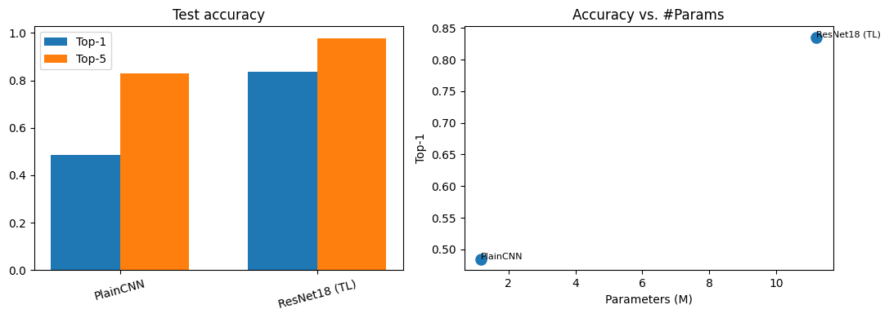](Outputs/figures/Q2_model_comparison.png)

- ResNet-18 的參數量約為 Plain CNN 的 **9.5 倍**，Top-1 高 **35.1 個百分點**，Macro-AUC 高約 0.047，遷移學習以較多的參數換到很大的準確率提升。
- 兩個模型 AUC 最低的 5 個類別有 4 個相同（american_pit_bull_terrier、staffordshire_bull_terrier、chihuahua、boxer），表示這些品種本身就難分，並非單一模型的問題。ResNet-18 的最低 5 名中另有 Ragdoll（0.984，與 Birman 互相混淆）。
- Macro-AUC 比 Top-1 高很多，因為 AUC 衡量機率排序能力：即使 argmax 預測錯誤，正確類別的分數仍可能排在前面（Top-5 遠高於 Top-1 也是同樣原因）。
- Plain CNN 總訓練時間較長，是因為它訓練 30 個 epoch（ResNet 為 10）；以每個 epoch 計，Plain CNN 約 12.8 s、ResNet-18 約 17.1 s，ResNet-18 因參數與輸入解析度（224 vs. 128）較大而較慢。

### Quiz2-4 完整 5-Fold 交叉驗證

**做法**：對 trainval 的 5 折各自重新建模、訓練，並在該折驗證集評估；fold 0 沿用上面已訓練好的模型。只使用 trainval，不碰 test。目的是確認 fold 0 的成績不是靠運氣切到特定資料。

| 模型      | Fold 0 | Fold 1 | Fold 2 | Fold 3 | Fold 4 | **Top-1 平均 ± 標準差** | Top-5 平均 ± 標準差 |
| --------- | ------ | ------ | ------ | ------ | ------ | ----------------------- | ------------------- |
| Plain CNN | 54.76% | 51.90% | 52.04% | 52.99% | 53.40% | **53.02% ± 1.16%**      | 86.96% ± 1.82%      |
| ResNet-18 | 87.50% | 86.68% | 84.65% | 85.60% | 88.04% | **86.49% ± 1.38%**      | 98.37% ± 0.58%      |

| Plain CNN | ResNet-18 |
| --------- | --------- |
| [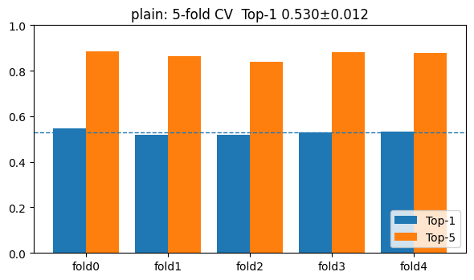](Outputs/figures/Q2_plain_kfold.png) | [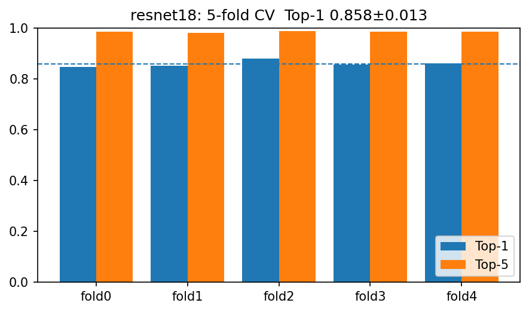](Outputs/figures/Q2_resnet18_kfold.png) |

- 兩模型平均差距約 33.5 個百分點，每一折的差距都落在 32.6 ~ 34.8 個百分點，遠大於各自的標準差（約 1.2 ~ 1.4），**ResNet-18 優於 Plain CNN 的結論穩定**。
- Fold 0 的成績比 5 折平均略高（Plain +1.7、ResNet +1.0 個百分點），仍在約 1 ~ 1.5 個標準差內，屬正常波動；後續以 fold 0 做驗證的實驗，數值可能略偏樂觀。
- **Test Top-1 比 5 折驗證平均低**：Plain CNN 低約 4.6 個百分點（53.0% → 48.5%）、ResNet-18 低約 3.0 個百分點（86.5% → 83.5%）。兩個模型方向一致，且超過折間標準差。可能原因是官方 test 本身略難或分佈略有不同，也可能有 epoch 挑選的輕微樂觀偏差。

### Quiz2 進階：超參數實驗

> 以下每一組設定都是**重新初始化模型並重新訓練**（超參數須在訓練前決定，無法套用在已訓練模型上），所以**不使用**上面 Quiz2-1 / 2-2 訓練好的模型。
> 為節省時間，每組只訓練較少的 epoch，且只用 Fold 0 的驗證集比較，不碰 test。各組之間可互相比較，但**不能與 30 / 10 epochs 的主模型直接比較**。
> 驗證集僅 736 張，且每組只訓練一次：Plain CNN 準確率約 24% 時標準誤約 ±1.6 個百分點、ResNet-18 準確率約 90% 時約 ±1.1 個百分點，**差距在 3（Plain）/ 2（ResNet）個百分點內不宜視為顯著**。

#### Plain CNN 實驗設計

採 **one-factor-at-a-time**：以 base 為基準，每次只改一個因素。

- **Base**：widths (32, 64, 128, 256)、dropout 0.3、AdamW、lr 2e-3、無擴增、無 label smoothing，**8 epochs**，輸入 128 × 128。
- **變動因素**：學習率（5e-4 / 5e-3）、網路寬度（narrow 16 ~ 128 / wide 64 ~ 512）、Dropout（0.0 / 0.5）、資料擴增（basic / strong）、Optimizer（SGD，lr 2e-2）、Label smoothing（0.1）。

| 設定                 | 參數量 | val Top-1 | val Top-5 | train Top-1 | 與 base 差異 |
| -------------------- | ------ | --------- | --------- | ----------- | ------------ |
| base                 | 1.18M  | 23.91%    | 58.83%    | 26.22%      | —            |
| lr = 5e-4            | 1.18M  | 25.68%    | 60.05%    | 30.64%      | +1.8         |
| lr = 5e-3            | 1.18M  | 16.58%    | 49.46%    | 21.03%      | −7.3         |
| wide (64 ~ 512)      | 4.71M  | 21.60%    | 59.24%    | 28.63%      | −2.3         |
| narrow (16 ~ 128)    | 0.30M  | 19.70%    | 50.14%    | 20.31%      | −4.2         |
| dropout = 0.0        | 1.18M  | **26.49%** | 63.45%   | 31.56%      | +2.6（最佳） |
| dropout = 0.5        | 1.18M  | 17.53%    | 52.58%    | 21.88%      | −6.4         |
| aug = basic          | 1.18M  | 25.95%    | 60.60%    | 28.26%      | +2.0         |
| aug = strong         | 1.18M  | 13.99%    | 44.16%    | 15.05%      | −9.9（最差） |
| opt = SGD            | 1.18M  | 25.41%    | 62.09%    | 31.01%      | +1.5         |
| label smoothing 0.1  | 1.18M  | 22.01%    | 57.47%    | 26.70%      | −1.9         |

[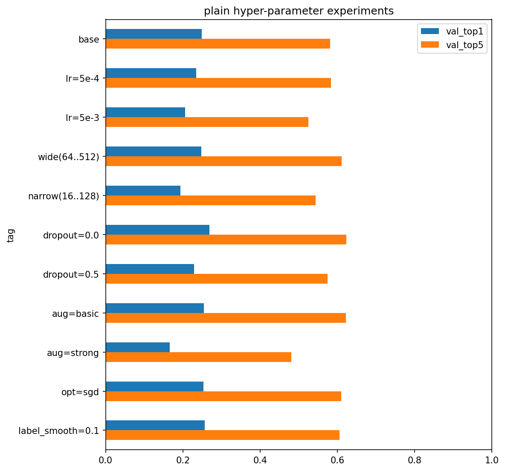](Outputs/figures/Q2_plain_hparam_experiments.png)

**分析**

- 8 epochs 時所有設定的訓練準確率只有 15% ~ 32%，**模型仍在欠擬合**，因此「增加正則化」（dropout = 0.5、強擴增）反而大幅傷害表現。
- 明顯有害（差距大於 4 個百分點）的是：強擴增（−9.9）、lr = 5e-3（−7.3）、dropout = 0.5（−6.4）、網路過窄（−4.2）。加寬網路（4 倍參數）沒有帶來收益。
- dropout = 0.0、aug = basic、lr = 5e-4、SGD 看起來略優於 base（+1.5 ~ +2.6），方向符合「欠擬合時降低正則化、使用較穩的學習率有利」，但都落在雜訊範圍內，單次實驗無法確認。
- 此表是短訓練下的比較，**不代表 30 epochs 完整訓練後的排序**（完整訓練時過擬合才是主要問題，見 Quiz3）。

#### ResNet-18 Backbone 實驗設計

- **Base**：ResNet-18 全網路微調、AdamW、lr 1e-3、無擴增、無 label smoothing，**5 epochs**，輸入 224 × 224。
- **變動因素**：凍結 backbone（只訓練分類頭，lr 3e-3）、學習率（1e-4 / 3e-3）、Optimizer（SGD，lr 1e-2）、資料擴增（basic / strong）、Label smoothing（0.1）、換 Backbone（MobileNetV2 / ResNet-50）。

| 設定                          | 參數量 | 可訓練參數 | val Top-1 | val Top-5 | train Top-1 | 與 base 差異 |
| ----------------------------- | ------ | ---------- | --------- | --------- | ----------- | ------------ |
| base（ResNet-18，AdamW 1e-3） | 11.20M | 11.20M     | 86.14%    | 98.91%    | 99.93%      | —            |
| 凍結（只訓練分類頭）          | 11.20M | 0.019M     | 90.76%    | 99.59%    | 94.53%      | +4.6         |
| lr = 1e-4                     | 11.20M | 11.20M     | 89.40%    | 99.32%    | 99.46%      | +3.3         |
| lr = 3e-3                     | 11.20M | 11.20M     | 78.26%    | 98.10%    | 99.18%      | −7.9         |
| opt = SGD                     | 11.20M | 11.20M     | **91.85%** | 99.46%   | 99.93%      | +5.7         |
| aug = basic                   | 11.20M | 11.20M     | 88.86%    | 99.18%    | 99.15%      | +2.7         |
| aug = strong                  | 11.20M | 11.20M     | 86.14%    | 98.91%    | 92.80%      | 0.0          |
| label smoothing 0.1           | 11.20M | 11.20M     | 88.86%    | 98.78%    | 99.69%      | +2.7         |
| MobileNetV2                   | 2.27M  | 2.27M      | 91.71%    | **99.73%** | 99.97%     | +5.6         |
| ResNet-50                     | 23.58M | 23.58M     | 90.35%    | **99.73%** | 99.80%     | +4.2         |

[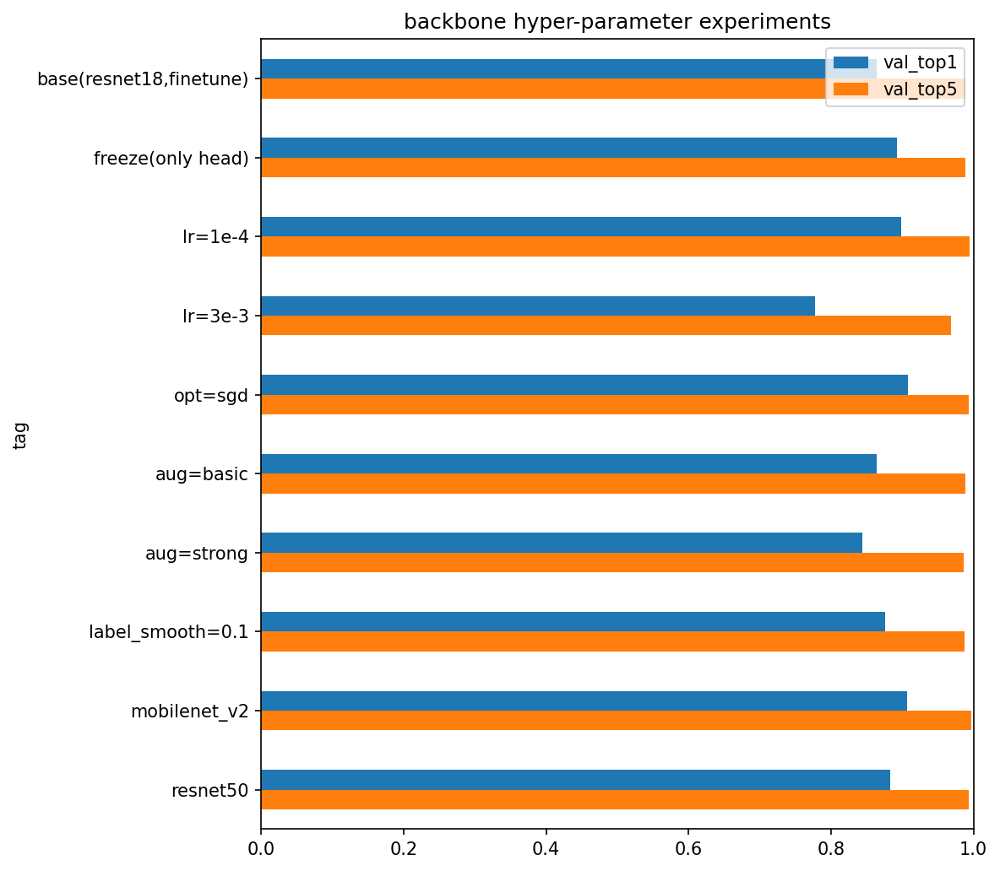](Outputs/figures/Q2_backbone_hparam_experiments.png)

**分析**

- **學習率與優化器是最敏感的因素**：lr 太大（3e-3）下降 7.9 個百分點，明顯破壞預訓練特徵；較小的 lr（1e-4，+3.3）或 SGD（+5.7）都優於 base。連只訓練分類頭的凍結版本（90.8%）都比 base 高 4.6 個百分點，且訓練 / 驗證差距小得多（94.5% vs. 90.8%；base 為 99.9% vs. 86.1%），顯示 base 的 AdamW lr = 1e-3 對全網路微調偏激進。
- 第一梯隊（SGD、MobileNetV2、凍結、ResNet-50）的 val Top-1 只差約 1.5 個百分點，落在雜訊範圍內，無法分出高下。
- **MobileNetV2 的性價比最高**：參數量只有 ResNet-18 的約 1/5、ResNet-50 的約 1/10，準確率卻與最佳設定相當。ResNet-50 比 ResNet-18 base 高 4.2 個百分點，但參數是 2 倍以上，仍不及 MobileNetV2。
- 擴增：basic 小幅提升（+2.7，接近雜訊範圍）；strong 與 base 持平（86.1%），訓練時間卻近 2 倍（162 s vs. 88 s），5 epochs 內尚未看到收益。
- 啟示：Quiz2 主模型的 lr = 1e-3 並非最佳，改用 SGD 或 lr = 1e-4 預期可再提升（**本次未重新訓練驗證**）。

---

## Quiz3 提升泛化能力與模型解釋

### Quiz3-1 資料擴增前後比較

**實驗設計**

- **擴增前**：直接沿用 Quiz2 訓練好的 Plain CNN / ResNet-18（皆為無擴增）。
- **擴增後**：相同的超參數與 epoch（Plain 30 / ResNet 10）、相同種子，**只改擴增策略並重新訓練**（擴增發生在訓練階段，無法套在已訓練模型上）。
- 擴增只作用於訓練集；驗證 / 測試集只做 Resize + Normalize。「train」準確率是在**未擴增**的訓練影像上評估，train − val gap 用來衡量過擬合。

**擴增策略**

| 策略        | 內容                                                                                   | 設計理由                                                                                   |
| ----------- | -------------------------------------------------------------------------------------- | ------------------------------------------------------------------------------------------ |
| none        | 無擴增（基準）                                                                         | 對照組                                                                                     |
| geometric   | RandomResizedCrop（scale 0.6 ~ 1）+ 水平翻轉 + 旋轉 ±15°                              | 模擬拍攝距離、構圖與角度差異；**不用垂直翻轉**（寵物幾乎不會倒立）；crop 不縮太小，避免裁掉耳型、臉部等品種特徵 |
| photometric | ColorJitter（亮度 / 對比 / 飽和 0.3，色相僅 0.03）+ 輕微模糊                           | 模擬光線與相機差異；**色相刻意只動一點**，因為毛色是品種的重要線索                          |
| full        | geometric + photometric + RandomErasing（p = 0.25）                                    | RandomErasing 隨機遮蔽局部，迫使模型使用多個部位判斷，降低過擬合                            |
| trivialaug  | crop / flip + TrivialAugmentWide                                                       | 自動化擴增對照組（已實作於程式中，本次實驗未訓練）                                          |

[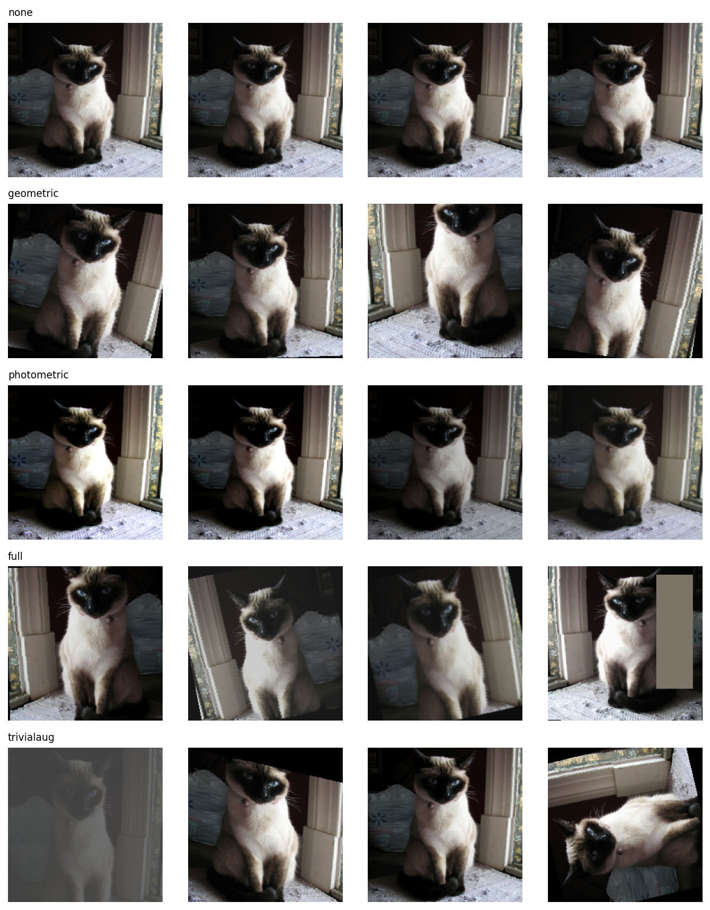](Outputs/figures/Q3_aug_examples.png)

**結果**

| 模型      | 擴增      | train（無擴增圖） | val Top-1 | test Top-1 | test Top-5 | train − val gap | 訓練時間 |
| --------- | --------- | ----------------- | --------- | ---------- | ---------- | --------------- | -------- |
| Plain CNN | none      | 96.2%             | 54.8%     | 48.5%      | 83.1%      | 0.414           | 383 s    |
| Plain CNN | geometric | 69.3%             | 51.6%     | 45.8%      | 81.4%      | 0.177           | 426 s    |
| Plain CNN | full      | 53.6%             | 42.0%     | 40.3%      | 77.4%      | 0.117           | 604 s    |
| ResNet-18 | none      | 100%              | 87.5%     | 83.5%      | 97.9%      | 0.125           | 171 s    |
| ResNet-18 | geometric | 99.8%             | 88.0%     | **83.7%**  | 97.8%      | 0.118           | 186 s    |
| ResNet-18 | full      | 99.3%             | **89.7%** | 83.6%      | 97.4%      | **0.096**       | 338 s    |

| Plain CNN | ResNet-18 |
| --------- | --------- |
| [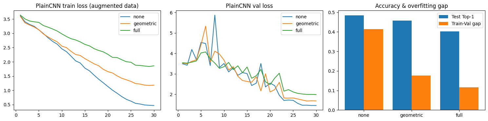](Outputs/figures/Q3_plaincnn_aug_comparison.png) | [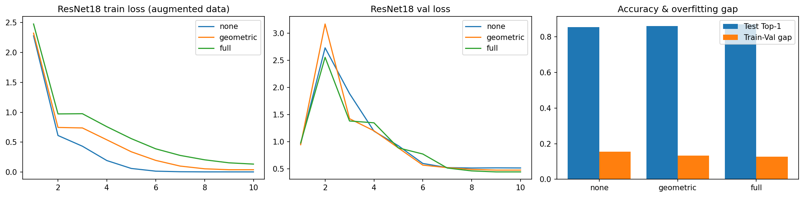](Outputs/figures/Q3_resnet18_aug_comparison.png) |

**分析**

- **ResNet-18**：擴增使 train − val gap 由 0.125 降到 0.096（full），val Top-1 由 87.5% 升到 89.7%（+2.2 個百分點）；但 **test Top-1 幾乎沒變**（83.5% → 83.7% / 83.6%），test Top-5 反而略降（97.9% → 97.8% / 97.4%）。**本次沒有看到擴增帶來實際的泛化增益**，只看到過擬合程度縮小。推測原因是 10 epochs 太短、預訓練特徵本身已很強。
- **Plain CNN**：擴增確實**大幅縮小過擬合**（gap 0.414 → 0.177 / 0.117），但**準確率反而下降**（test Top-1 48.5% → 45.8% / 40.3%），與原先「從零訓練的小模型受益最大」的預期**不符**。未擴增圖上的訓練準確率只剩 69.3% / 53.6%，代表模型在固定的 30 epochs 內尚未擬合擴增後的資料（欠擬合）。較合理的推測是需要更多 epochs 才能發揮擴增效果，**本次未驗證**。
- **成本**：full 策略使訓練時間增為約 2 倍（ResNet-18：171 → 338 s）與 1.6 倍（Plain CNN：383 → 604 s）；geometric 只增加約 9 ~ 11%（影像轉換在 CPU 上進行，Colab 僅 2 核心）。

### Quiz3-2 Kernel 視覺化

**做法**：取 Quiz3 擴增（驗證 Top-1 最佳者為 `full`）後的 ResNet-18，視覺化**第一層 7×7 卷積**。先畫出全部 64 個 kernel，再挑兩個：一個邊緣 / 紋理型、一個色彩型，並顯示它們對同一張輸入圖產生的 feature map。範例輸入為測試集第 0 張（Abyssinian：一隻坐在木桌上的貓）。

[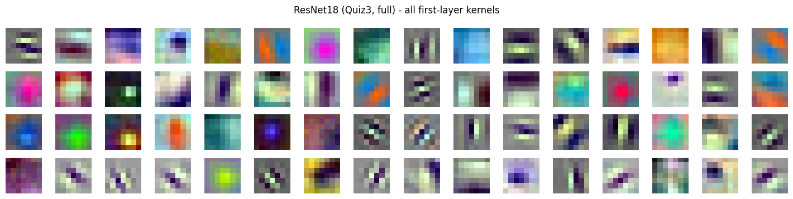](Outputs/figures/Q3_resnet18_q3_all_kernels.png)

[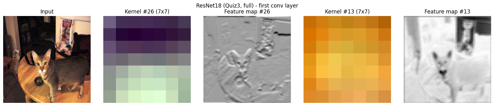](Outputs/figures/Q3_resnet18_q3_two_kernels.png)

| Kernel | 外觀                           | 推測用途                                                                                                                       |
| ------ | ------------------------------ | ------------------------------------------------------------------------------------------------------------------------------ |
| #26    | 上半部偏暗、下半部偏亮         | **水平邊緣（亮度漸層）偵測器**。feature map 呈浮雕狀，突顯水平方向的邊緣（桌緣、貓的頭頂與耳朵輪廓、背景物件的邊界），垂直方向結構被抑制，用於萃取形狀輪廓與紋理的方向資訊。 |
| #13    | 整體平滑、橙黃色               | **低頻色彩 / 亮度色塊偵測器**。沒有邊緣結構；貓的臉部五官、黑色背包與陰影等暗處響應最低，推測它在偵測整塊暖色 / 亮度區域，與毛色、光線有關。 |

- 全部 64 個 kernel 可看出兩大類：**不同方向的邊緣 / 條紋**，以及**色彩對比 / 色塊**，這是 CNN 第一層常見的濾波器。後續層再把它們組合成耳朵、眼睛、毛紋等高階特徵。
- 這些 kernel 主要沿用 ImageNet 預訓練的通用濾波器；本次未與預訓練原始權重比對變化量。
- 用途判讀以 kernel 圖與 feature map 為準；程式中的數值指標（`edge_score`、`orient_sel`）為輔助、屬相對數值。

### Quiz3-3 XAI：Grad-CAM 與 Occlusion Sensitivity

**做法**（模型：Quiz3 擴增 `full` 的 ResNet-18，Test Top-1 = 83.62%）

- **Grad-CAM**：取最後一層卷積的特徵圖，以目標類別分數對該層的梯度做通道加權，得到注意力熱圖並放大回輸入大小（7×7 放大，空間解析度較粗）。
- **Occlusion Sensitivity**：用 32×32 灰色方塊（stride 16）滑動遮蔽，記錄預測機率下降多少，下降越多代表該區域越重要。此法不依賴梯度，可與 Grad-CAM 交叉驗證。
- 由測試集預測結果中挑選 3 個答對案例與 3 個**高信心錯誤**案例做定性分析。
- 另從測試集抽取 150 張影像，利用官方 **Trimap** 對 Grad-CAM 做前景注意力的**定量**分析，並比較 Quiz2（無擴增）與 Quiz3（full 擴增）的 ResNet-18。

#### 定性分析

**答對的案例**（shiba_inu × 2、miniature_pinscher）

[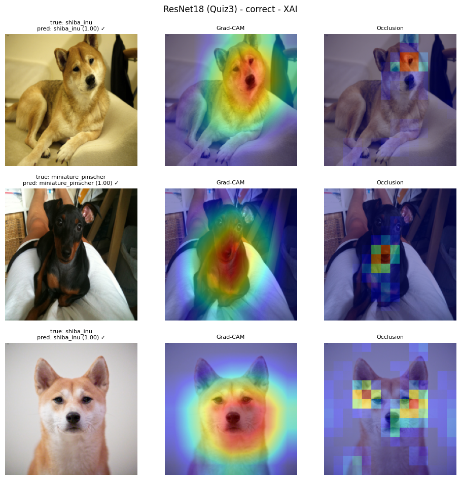](Outputs/figures/Q3_resnet18_q3_correct_xai.png)

Grad-CAM 的高亮區集中在**臉部與頭頸**（shiba_inu 為臉與胸前，miniature_pinscher 為臉與上半身），Occlusion 的高敏感方塊也落在眼睛、鼻口與臉頰周圍；背景（沙發、牆面、人腿與白色毯子）貢獻很小。兩種方法互相印證，表示模型主要依**動物本體的臉部特徵**判斷，而非背景。

**高信心錯誤案例**

[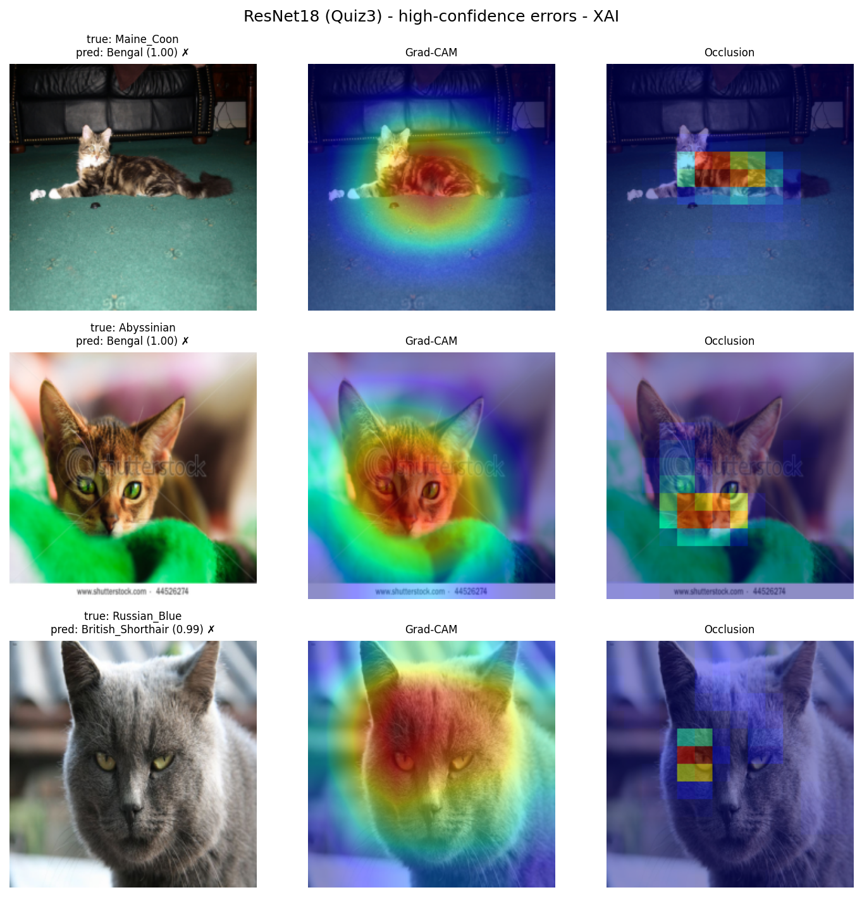](Outputs/figures/Q3_resnet18_q3_errors_xai.png)

| 真實類別      | 預測（信心）            | 模型關注的區域與推測原因                                                           |
| ------------- | ----------------------- | ---------------------------------------------------------------------------------- |
| Maine_Coon    | Bengal (1.00)           | 貓在畫面中佔比較小，注意力主要落在身體上的虎斑花紋，該斑紋與 Bengal 極為相似       |
| Abyssinian    | Bengal (1.00)           | 注意力集中於臉部與眼睛，部分延伸至綠色背景布料；影像同時有浮水印與強烈背景色干擾，且臉部輪廓與 Bengal 相近 |
| Russian_Blue  | British_Shorthair (0.99) | 注意力主要在臉部與眼睛；兩品種皆為灰藍短毛、圓臉，細微特徵難以區分                 |

- 模型的失誤不一定是完全「看錯位置」，而可能是看到了具辨識性的局部特徵，但不同品種共享相似的視覺特徵。
- 部分錯誤的預測信心接近 1.0，顯示有**過度自信（over-confidence）**的問題，後續可考慮 label smoothing、溫度校正（Temperature Scaling）。

#### Trimap 前景注意力量化

使用 Oxford-IIIT Pet 的 Trimap 對 Grad-CAM 熱圖量化（Trimap 與熱圖以同一尺寸 224 × 224、最近鄰縮放對齊；前景 = 寵物本體 + 邊界）。

| 指標 | 說明 |
| --- | --- |
| fg_energy | Grad-CAM 熱圖能量落在寵物前景區域的比例，越高代表重要性越集中於寵物 |
| fg_area | 寵物前景占整張影像的面積比例（均勻分佈時的基準） |
| gain | fg_energy / fg_area，逐張計算後取平均；> 1 表示注意力比均勻分佈更集中於寵物 |
| hit | Grad-CAM 熱圖最高響應位置落在寵物前景內的比例 |

**結果（測試集隨機抽樣 150 張）**

| 模型 | 樣本 | n | fg_energy | fg_area | gain | hit |
|---|---|---|---|---|---|---|
| 擴增後（Quiz3 full） | 全部 | 150 | 0.669 | 0.427 | 1.753 | 0.98 |
| | 答對 | 120 | 0.700 | 0.451 | 1.709 | 1.00 |
| | 答錯 | 30 | 0.545 | 0.331 | 1.925 | 0.90 |
| 擴增前（Quiz2） | 全部 | 150 | 0.655 | 0.427 | 1.721 | 0.98 |
| | 答對 | 131 | 0.650 | 0.418 | 1.744 | 0.99 |
| | 答錯 | 19 | 0.689 | 0.492 | 1.563 | 0.89 |

結果存於 `Outputs/q3_xai_resnet18_q3_aug.csv`、`Outputs/q3_xai_resnet18_q2_noaug.csv`。

1. **模型整體確實主要關注寵物本體。** 寵物約只占影像 42.7% 的面積，卻有約 65 ~ 67% 的 Grad-CAM 能量落在寵物前景，gain 約 1.7 ~ 1.75，且約 98% 的樣本其最高注意力位置落在寵物前景。這與 Grad-CAM + Occlusion 的定性案例一致。
2. **資料擴增對注意力位置的影響有限。** Quiz3 full 相較 Quiz2，fg_energy 由 0.655 升到 0.669、gain 由 1.721 升到 1.753，fg_area 與 hit 完全相同。目前沒有足夠證據認為擴增明顯改變了模型的注意力位置。
3. **答錯案例的寵物通常較小。** Quiz3 模型中，答錯的 fg_area 為 0.331、低於答對的 0.451；fg_energy（0.545 vs. 0.700）與 hit（0.90 vs. 1.00）也較低，表示寵物在畫面中占比小時，模型較容易受局部特徵或背景干擾。答錯組的 gain 較高（1.925），是因為前景面積小、基準值低，並非注意力更好。
4. **部分錯誤屬細粒度品種間的高度相似，而非注意力錯位。** 例如 Maine Coon → Bengal、Russian Blue → British Shorthair，即使模型關注臉部或身體等合理區域，仍可能因共享相似的毛色、花紋與臉部特徵而誤判。

**限制**：(1) 量化僅 150 張，答錯組只有 19 ~ 30 張，需注意抽樣數量與樣本分布；(2) Grad-CAM 來自 7×7 特徵圖放大，空間解析度較粗；(3) 擴增前後的比較只有單一模型、單次訓練。

---

## 整體結論與限制

### 結論

1. **模型比較**：遷移學習的 ResNet-18（11.2M）Test Top-1 83.5%、Top-5 97.9%、Macro-AUC 0.994，遠勝自行設計的 Plain CNN（1.18M，48.5% / 83.1% / 0.947）；5-Fold CV 顯示此差距穩定（86.5% ± 1.4% vs. 53.0% ± 1.2%，每折都領先約 33 個百分點）。兩者最難分的品種相同（american_pit_bull_terrier、staffordshire_bull_terrier、chihuahua、boxer），屬資料本身的細粒度困難。
2. **超參數**：Plain CNN 在短訓練下處於欠擬合（訓練準確率僅 15% ~ 32%），只有強擴增、dropout = 0.5、lr = 5e-3、過窄網路明顯有害（−4 ~ −10 個百分點），其餘差異落在雜訊範圍內；ResNet-18 對學習率與優化器最敏感，**SGD、lr = 1e-4、甚至只訓練分類頭都優於 AdamW 1e-3**（+3 ~ 6 個百分點），MobileNetV2（2.3M）達到 91.7%，與最佳設定同級，性價比最高。
3. **資料擴增**：對 ResNet-18 能縮小過擬合（gap 0.125 → 0.096）並提高 val（87.5% → 89.7%），但 **test Top-1 幾乎不變（83.5% → 83.6%，在誤差內）**，本次設定下沒有看到實際泛化增益；對 Plain CNN 雖大幅降低過擬合（gap 0.414 → 0.117 ~ 0.177），但在 30 epochs 內造成欠擬合、test 準確率下降（48.5% → 45.8% / 40.3%），需更長訓練才能判斷其真實效益。
4. **可解釋性**：第一層 kernel 為方向邊緣與色彩色塊兩類；Grad-CAM / Occlusion 顯示模型聚焦在臉部，Trimap 量化（150 張）顯示約 67% 的熱圖能量落在占 43% 面積的寵物前景，擴增前後幾乎相同。錯誤多來自外觀相近的品種對（staffordshire / pit bull / american_bulldog、basset_hound / beagle、Ragdoll / Birman），且信心接近 1.0，有過度自信的問題。
5. **驗證與測試的落差**：兩個模型的 Test Top-1 都比 5 折驗證平均低約 3 ~ 5 個百分點（ResNet-18：86.5% → 83.5%；Plain CNN：53.0% → 48.5%），選模型與解讀驗證成績時要留意此差距。

### 限制與後續

- 超參數與擴增實驗皆為單折單次，小差距可能只是隨機波動。
- Test 有 3,669 張，Top-1 標準誤約 0.6 ~ 0.8 個百分點，1 ~ 2 個百分點內的差距（例如擴增對 ResNet-18 的 test 差異）不宜視為顯著。
- XAI 量化僅 150 張，答錯組只有 19 ~ 30 張。
- 後續可做：以 SGD 或 lr = 1e-4 重新訓練 ResNet-18，並搭配較長的 epochs 再檢驗擴增是否有效；Plain CNN + 擴增訓練更多 epochs；以 label smoothing 或溫度校正改善過度自信；查明 Test 偏低的原因（例如檢查各品種在 test 的表現差異）。
